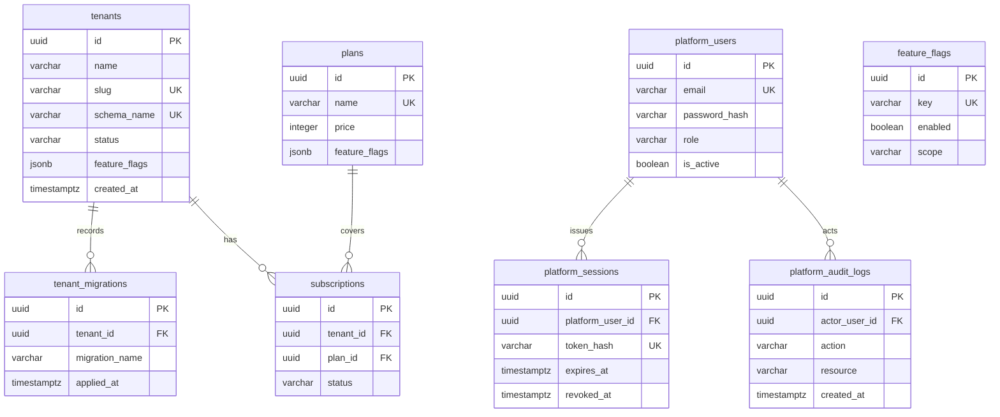
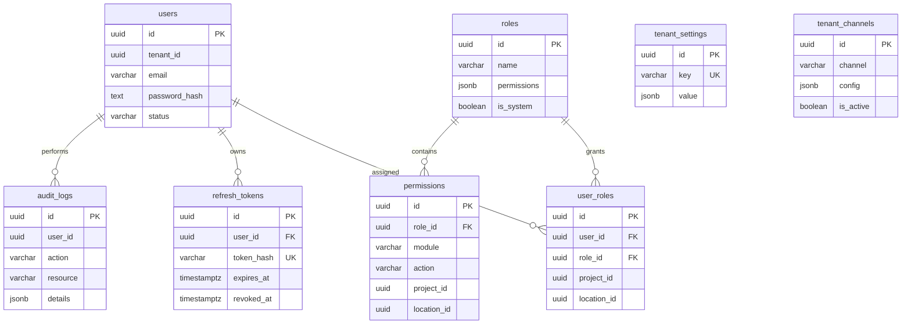

# Data model (Phase 0 / Phase 1)

Canonical ER overview for the control plane (`public`) and tenant identity schema. Kept current with provisioning + migration runner (`lib/tenants/migrations.ts`).

## Control plane (`public`)

Notes:
- Tenant lifecycle statuses: `provisioning` | `active` | `failed` | `suspended`.
- `plans` / `subscriptions` / platform kill-switches exist in schema; commercial ops remain Phase 12 product scope.
- Refresh for platform admins is stored in `platform_sessions` (hashed tokens).

## Tenant schema (`tenant_<slug>`) — identity core

Applied by migration `001_identity_core`.

## Four-axis AuthZ (runtime)

Evaluated in `lib/rbac/scope.ts` and enforced by `requireTenantApi`:

1. **Role / permission** — seeded matrix + JWT `permissions`
2. **Module** — tenant `tenant_settings.feature_flags` (`false` disables)
3. **Project** — JWT `projectIds` from `user_roles.project_id` (empty ⇒ unrestricted)
4. **Location** — JWT `locationIds` from `user_roles.location_id` (empty ⇒ unrestricted)

Active-tenant checks run in API gates (`assertTenantActive`) because Edge middleware cannot query Postgres.
