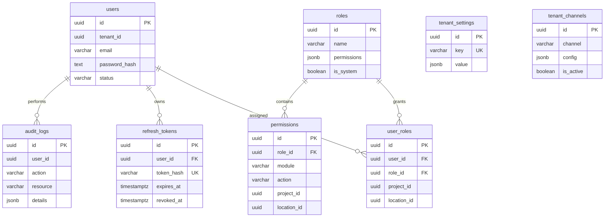
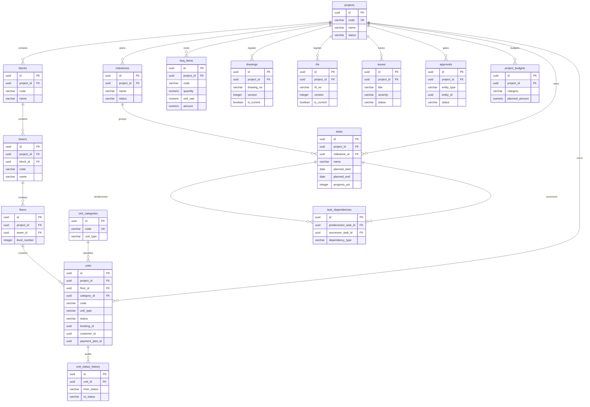

# Data model (Phase 0 / Phase 1 / Phase 2)

Canonical ER overview for the control plane (`public`) and tenant schemas. Kept current with provisioning + migration runner (`lib/tenants/migrations.ts`).

## Control plane (`public`)

Notes:
- Tenant lifecycle statuses: `provisioning` | `active` | `failed` | `suspended`.
- `plans` / `subscriptions` / platform kill-switches exist in schema; commercial ops remain Phase 12 product scope.

## Tenant schema — identity core (`001_identity_core`)

## Tenant schema — Property + Planning-lite (`002_property_planning`)

PRD hierarchy: **Company (tenant) → Project → Block → Tower → Floor → Unit**.

### Unit status (PRD §8.3)

`available` → `reserved` → `booked` → `cancelled` | `completed` → `delivered`  
Every change writes `unit_status_history`.

### Planning notes (PRD §8.4)

- Task dependencies are **finish-to-start (`FS`)** in v1.
- Gantt API returns tasks + dependencies; **critical-path (CPM) is P1**.
- Drawings and RFIs are versioned (`version`, `supersedes_id`, `is_current`).
- Unit link columns `booking_id` / `customer_id` / `payment_plan_id` are reserved for Phases 3–5.

## Four-axis AuthZ (runtime)

Evaluated in `lib/rbac/scope.ts` and enforced by `requireTenantApi` / `requireProjectApi`:

1. **Role / permission** — seeded matrix + JWT `permissions` (`projects.*`)
2. **Module** — tenant `feature_flags.projects === false` denies
3. **Project** — JWT `projectIds` (empty ⇒ unrestricted)
4. **Location** — JWT `locationIds` (empty ⇒ unrestricted)

Active-tenant checks run in API gates (`assertTenantActive`) because Edge middleware cannot query Postgres.
