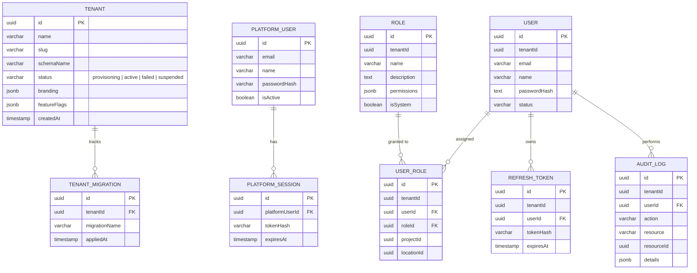

# Data Model (Phase 0 & 1)

This ER diagram represents the core tables for the `control_plane` schema and the `tenant_<id>` schema base tables.

```mermaid
erDiagram
    %% Control Plane (Public Schema) %%
    TENANT {
        uuid id PK
        varchar name
        varchar slug
        varchar schemaName
        varchar status "provisioning | active | failed | suspended"
        jsonb branding
        jsonb featureFlags
        timestamp createdAt
    }
    
    TENANT_MIGRATION {
        uuid id PK
        uuid tenantId FK
        varchar migrationName
        timestamp appliedAt
    }
    
    PLATFORM_USER {
        uuid id PK
        varchar email
        varchar name
        varchar passwordHash
        boolean isActive
    }
    
    PLATFORM_SESSION {
        uuid id PK
        uuid platformUserId FK
        varchar tokenHash
        timestamp expiresAt
    }
    
    %% Tenant Schema (Base Identity) %%
    USER {
        uuid id PK
        uuid tenantId
        varchar email
        varchar name
        text passwordHash
        varchar status
    }
    
    ROLE {
        uuid id PK
        uuid tenantId
        varchar name
        text description
        jsonb permissions
        boolean isSystem
    }
    
    USER_ROLE {
        uuid id PK
        uuid tenantId
        uuid userId FK
        uuid roleId FK
        uuid projectId
        uuid locationId
    }
    
    REFRESH_TOKEN {
        uuid id PK
        uuid tenantId
        uuid userId FK
        varchar tokenHash
        timestamp expiresAt
    }
    
    AUDIT_LOG {
        uuid id PK
        uuid tenantId
        uuid userId FK
        varchar action
        varchar resource
        uuid resourceId
        jsonb details
    }
    
    %% Relationships %%
    TENANT ||--o{ TENANT_MIGRATION : "tracks"
    PLATFORM_USER ||--o{ PLATFORM_SESSION : "has"
    
    USER ||--o{ USER_ROLE : "assigned"
    ROLE ||--o{ USER_ROLE : "granted to"
    USER ||--o{ REFRESH_TOKEN : "owns"
    USER ||--o{ AUDIT_LOG : "performs"
```
